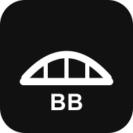
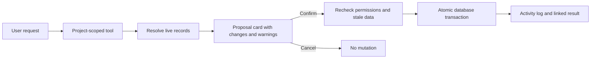
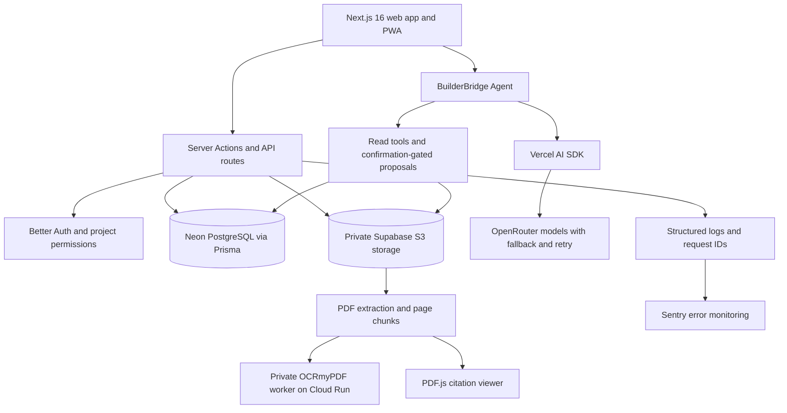

<p align="center">
  <a href="https://builderbridge.vercel.app/">
    
  </a>
</p>

<h1 align="center">BuilderBridge</h1>

<p align="center">
  <strong>The construction control room that keeps the schedule, the field, and every project decision connected.</strong>
</p>

<p align="center">
  <a href="https://builderbridge.vercel.app/"></a>
  <a href="https://github.com/Akash8585/builderbridge/actions/workflows/ci.yml"></a>
  
  
</p>

Construction teams rarely fail because they lack a schedule. They fail because the schedule, field updates, commitments, RFIs, submittals, drawings, and risk decisions live in different places.

BuilderBridge brings that operating loop into one product. Teams can plan the work, coordinate weekly commitments, surface blockers, understand portfolio health, and use a project-aware Agent to investigate or prepare changes without giving an AI silent write access.

> BuilderBridge is a working hackathon beta, not a landing-page prototype. The live application includes persistent project data, role-aware workflows, private document storage, confirmation-gated Agent actions, OCR-backed document retrieval, activity auditing, and production monitoring.

## Live Product

**Production:** [builderbridge.vercel.app](https://builderbridge.vercel.app/)

Create an account and a project, or seed the repository locally for a complete Riverside Apartments demo workspace.

## The Product in One Minute

| Layer | What BuilderBridge delivers |
| --- | --- |
| Plan | Master schedule, dependencies, critical path, Gantt, lookahead, pull planning, and weekly work plans |
| Control | Roadblocks, schedule impact requests, RFIs, submittals, drawings, baselines, and field updates |
| Learn | PPC, PRR, S-curves, schedule variance, portfolio health, and trade performance |
| Act | A persistent Agent that reads live project data and prepares reviewable changes |
| Trust | Role permissions, stale-change detection, explicit confirmation, idempotency, private files, and append-only audit history |

## Why the Agent Is Different

BuilderBridge does not treat AI as a text box floating beside the product. The Agent is connected to the same project controls the team uses every day.

### It can understand the live project

- Search tasks and resolve natural task names.
- Inspect members, schedule risk, open roadblocks, RFIs, submittals, impacts, and portfolio health.
- Keep separate, persistent conversations under each project or at portfolio level.
- Accept project files and retain their connection to the conversation.
- Search extracted document text and return secure, exact-page sources.
- Open citations in the in-app PDF viewer and highlight the supporting passage.
- OCR scanned PDFs and images through a private OCRmyPDF worker.

### It can prepare real project changes

The Agent can prepare proposals for:

- Creating or updating tasks.
- Recording status, actual dates, and percent complete.
- Adding, assigning, or resolving roadblocks.
- Creating and completing weekly commitments with variance reasons.
- Creating or reviewing schedule impact requests.
- Creating and comparing schedule baselines.
- Adding or removing dependencies and shifting schedules.
- Creating or updating RFIs and submittals.
- Turning a cited document page into an RFI, submittal, or roadblock.

### It cannot silently mutate the project

Every write follows the same guarded path:



This design gives the speed of natural language without replacing accountability. A proposal can expire, be cancelled, be rejected if its source data changed, and be safely confirmed only once.

## Five-Minute Judge Walkthrough

1. Open a seeded project and scan the project dashboard, Gantt, weekly plan, and roadblock log.
2. Open **Agent** and ask: `What needs attention on this project this week?`
3. Upload a PDF and ask: `What does this document say about the inspection requirement?`
4. Follow the page citation into the split-screen viewer and inspect the highlighted evidence.
5. Ask: `Add a roadblock to Rough electrical wiring for the pending city inspection and assign it to Sam.`
6. Review the proposed before/after card, confirm it, and follow the result back to the project record.
7. Open Activity to see the confirmed change in the project audit trail.

More useful prompts:

```text
Commit Rough plumbing install for next week.
Update Rough electrical wiring to 65% complete.
What happens downstream if Rough plumbing finishes on August 5?
Create an RFI from page 4 asking the architect to confirm the membrane detail.
Compare the current schedule with the latest baseline.
Which projects in the portfolio need executive attention?
```

## Core Workflows

### Schedule and planning

- Task ownership, dates, status, actual progress, and notes.
- Finish-to-start dependencies with cycle detection.
- Critical Path Method analysis and critical-path Gantt highlighting.
- Rolling 2, 4, and 6 week lookaheads.
- Pull-planning sequencing for GC and trade collaboration.
- Weekly commitments with PPC and protected historical records.
- Dependency-aware what-if schedule reflow before any dates are changed.

### Field and project controls

- Typed roadblocks with ownership, due dates, and resolution rules.
- Mobile-friendly task progress notes and photo updates.
- Schedule impact requests with review and proposed date effects.
- RFIs with linked tasks, answers, due dates, and overdue blocking behavior.
- Submittal workflow with spec sections, decisions, and due dates.
- Drawing revisions that preserve and supersede earlier versions.
- Baseline snapshots with task-level schedule variance.

### Portfolio intelligence

- Organization-wide executive dashboard.
- Shared multi-project timeline.
- Composite project health using PPC, PRR, variance, and open risk.
- Trade reliability across every active project.
- New-project onboarding checklist and purposeful empty states.

## Architecture



### Technology choices

| Area | Technology | Why |
| --- | --- | --- |
| Product | Next.js 16, React 19, TypeScript, Tailwind CSS 4 | One typed full-stack application with responsive server-rendered workflows |
| Agent | Vercel AI SDK, OpenRouter | Streaming tool use with provider flexibility, retry, and free-model fallback |
| Data | Prisma 6, Neon PostgreSQL | Relational integrity for schedules, permissions, proposals, and audit history |
| Identity | Better Auth | Email/password, Google OAuth, organizations, and durable sessions |
| Documents | Supabase Storage, PDF.js, unpdf, OCRmyPDF | Private files, browser-native review, extraction, and scanned-document support |
| Operations | Vercel, Google Cloud Run, Sentry | Deployable web and OCR services with correlated production diagnostics |
| Quality | Vitest, Playwright, GitHub Actions | Business-logic, real-database, and browser-level coverage |

## Security and Reliability

- Every project read and mutation is scoped by organization membership and project role.
- Agent tools use the same permission matrix as the UI and recheck access at confirmation time.
- Cross-project task, member, dependency, conversation, and attachment references are rejected.
- Private files are streamed through authenticated routes; storage credentials never reach the browser.
- File signatures, MIME types, names, duplicates, per-file limits, and organization quotas are validated.
- Views, downloads, and denied file requests are audited.
- Agent requests have per-user burst limits and organization monthly quotas.
- OpenRouter uses ordered model fallback and bounded retry for transient failures.
- Operational logs redact credentials, cookies, prompts, messages, document text, and personal email addresses.
- Sentry captures client, server, edge, and root React failures with production source maps.
- Request IDs correlate Vercel application logs with the OCR worker in Google Cloud Logging.

## Quality Evidence

BuilderBridge currently defines **263 automated checks**:

| Layer | Coverage |
| --- | ---: |
| Unit | 141 tests across permissions, scheduling math, intent parsing, uploads, PDF citations, telemetry privacy, and analytics |
| Integration | 94 real PostgreSQL/Supabase tests covering Agent reads and writes, stale proposals, cancellation, idempotency, role enforcement, files, and project controls |
| End-to-end | 28 Playwright flows across authentication, scheduling, weekly planning, files, PDFs, Agent behavior, navigation, accessibility, and mobile layouts |

The standard quality gate is:

```bash
npm run lint
npx tsc --noEmit
npx vitest run tests/unit
npx vitest run tests/integration --maxWorkers=1
npm run build
```

GitHub Actions runs lint, type checking, unit tests, and a production build on pushes and pull requests. Database integration tests run against an isolated database when `TEST_DATABASE_URL` is configured; Playwright runs through the manual CI workflow.

## Run Locally

### Prerequisites

- Node.js 20 or newer.
- A PostgreSQL database; Neon works well.
- Optional Docker installation for scanned-document OCR.

### 1. Install

```bash
git clone https://github.com/Akash8585/builderbridge.git
cd builderbridge
npm install
```

### 2. Configure

Create your local environment file:

```powershell
Copy-Item .env.example .env
```

```bash
cp .env.example .env
```

Minimum required configuration:

```dotenv
DATABASE_URL="postgresql://..."
BETTER_AUTH_SECRET="replace-with-at-least-32-random-bytes"
BETTER_AUTH_URL="http://localhost:3000"
GOOGLE_CLIENT_ID="your-google-client-id"
GOOGLE_CLIENT_SECRET="your-google-client-secret"
```

Optional capabilities are enabled only when their variables are present:

| Capability | Variables |
| --- | --- |
| Agent | `OPENROUTER_API_KEY`, `OPENROUTER_MODEL` |
| Private production files | `S3_ENDPOINT`, `S3_ACCESS_KEY_ID`, `S3_SECRET_ACCESS_KEY`, `S3_BUCKET`, `S3_REGION` |
| OCR | `OCR_SERVICE_URL`, `OCR_SERVICE_TOKEN` |
| Error monitoring | `NEXT_PUBLIC_SENTRY_DSN`, `SENTRY_ORG`, `SENTRY_PROJECT`, `SENTRY_AUTH_TOKEN` |
| Email | `RESEND_API_KEY`, `EMAIL_FROM` |
| Billing | `STRIPE_SECRET_KEY`, `STRIPE_WEBHOOK_SECRET`, Stripe price IDs |
| Integrations | Procore or Autodesk OAuth credentials |

See [.env.example](./.env.example) for the complete documented configuration.

### 3. Prepare the database

```bash
npx prisma migrate deploy
npm run db:seed
```

The seed creates a local demo organization, one complete project, and role-specific users. Seed credentials are intended for local development only and are printed by the seed script.

### 4. Start BuilderBridge

```bash
npm run dev
```

Open [http://localhost:3000](http://localhost:3000).

### Optional: start OCR locally

Set the same long random `OCR_SERVICE_TOKEN` in `.env` and Docker Compose, then run:

```bash
docker compose -f docker-compose.ocr.yml up --build
```

Searchable PDFs work without OCR. The worker is used only for scans and images that contain no extractable text.

## Repository Map

```text
src/app/                       App Router pages, APIs, and Server Actions
src/components/                Product UI, Agent workspace, and PDF viewer
src/lib/assistant-tools.ts     Project-scoped Agent read and proposal tools
src/lib/assistant-actions.ts   Confirmation, stale checks, transactions, audit
src/lib/permissions.ts         Audited project capability matrix
src/lib/document-extraction.ts PDF extraction, page chunks, and OCR pipeline
src/lib/observability.ts       Structured logs, request context, and Sentry
prisma/schema.prisma           Auth, planning, controls, Agent, and audit models
ocr-worker/                    Private OCRmyPDF Cloud Run service
tests/                         Unit, integration, and Playwright suites
```

## Deployment

The production topology uses Vercel, Neon PostgreSQL, a private Supabase Storage bucket, and a private OCR worker on Google Cloud Run.

Read [DEPLOYMENT.md](./DEPLOYMENT.md) for environment setup, migrations, storage security, OAuth callbacks, monitoring, and the post-deploy checklist.

## Hackathon Build Story

BuilderBridge was developed with Codex as an engineering collaborator across product design, repository exploration, implementation, debugging, migrations, tests, browser verification, deployment, and production monitoring.

The important outcome is not simply that AI helped write code. The product applies the same lesson to construction operations: an agent becomes useful when it can understand the real system, use constrained tools, expose its intended changes, and remain accountable to a human decision.

## Status and Roadmap

BuilderBridge is a controlled-beta candidate. The hackathon scope concentrates on the complete planning loop, trustworthy Agent actions, document intelligence, security, accessibility, and production observability.

Next product milestones include comments and mentions, notification workflows, field reports, meeting action items, hybrid semantic search, schedule imports/exports, and hardened production integrations. See [ROADMAP.md](./ROADMAP.md) for the full delivery plan.

---

<p align="center">
  <strong>BuilderBridge</strong><br />
  One schedule. One field plan. One accountable Agent.
</p>
