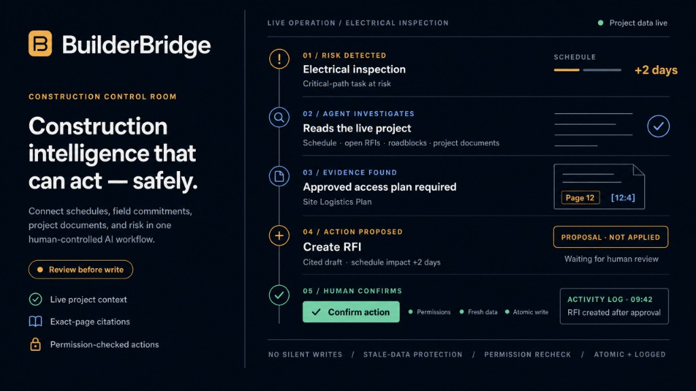
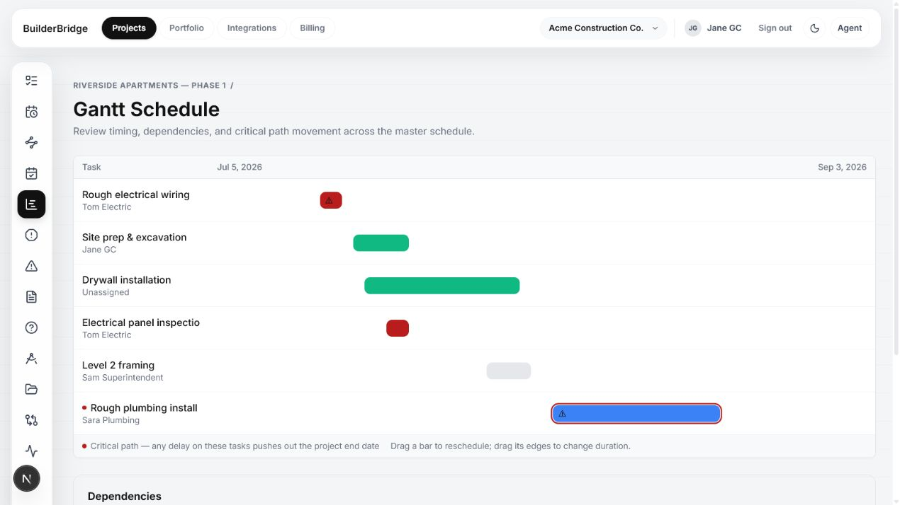
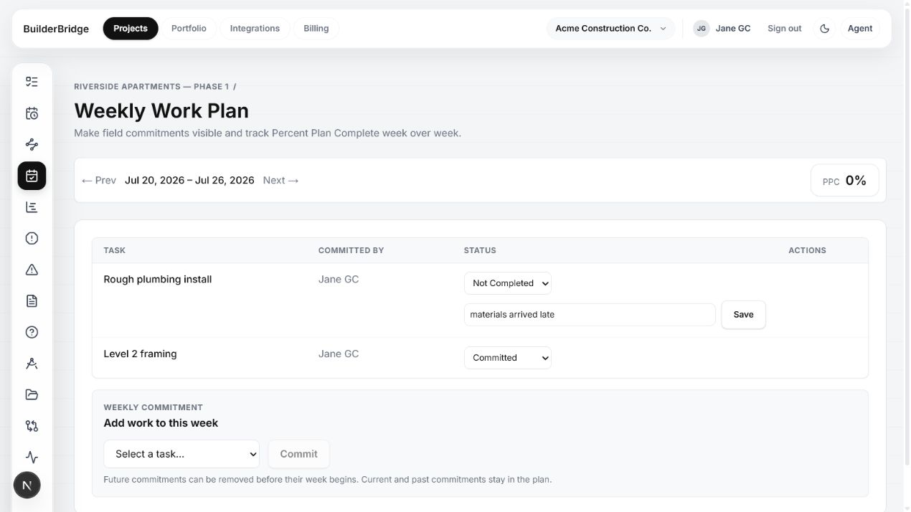
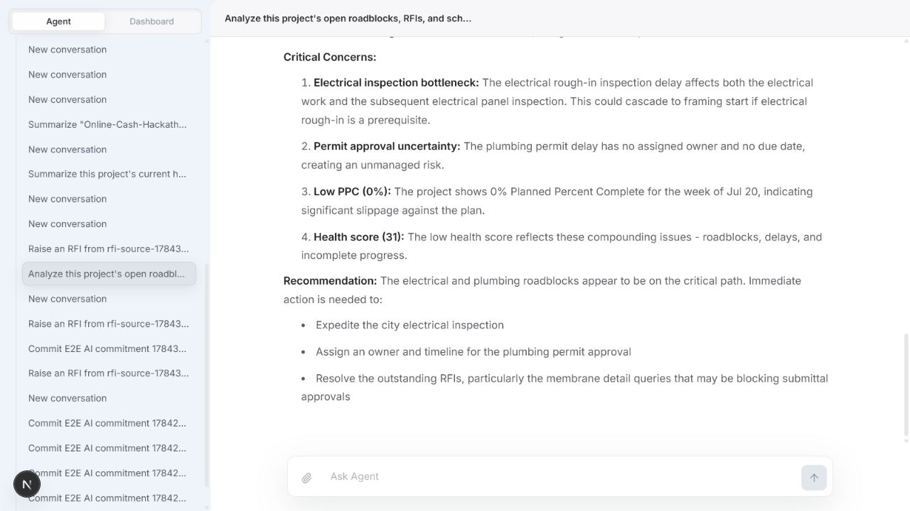
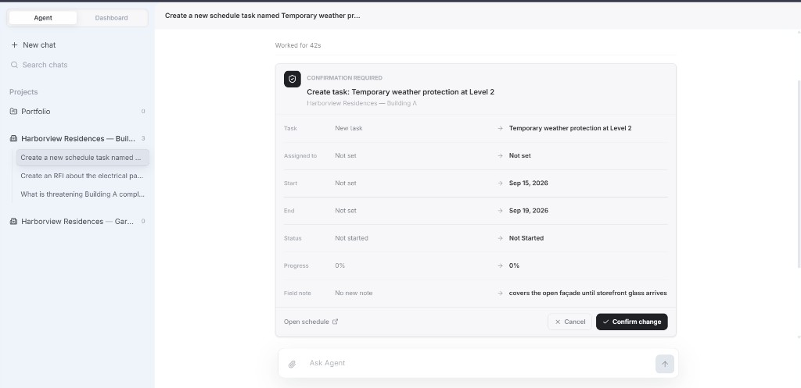
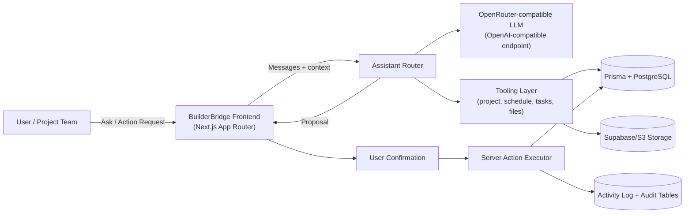
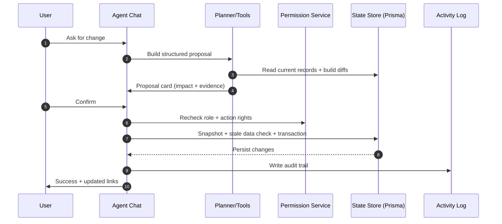

# BuilderBridge

**BuilderBridge turns construction schedules, weekly commitments, field progress, and project documents into one agent-controlled operating loop where every AI write is cited, reviewable, permission-checked, and auditable.**

Built for project managers, schedulers, superintendents, and trade partners who need the office plan and the jobsite to stay aligned -- without letting an AI silently change project records.

[](https://github.com/Akash8585/builderbridge/actions/workflows/ci.yml)


<p align="center">
  
</p>

<p align="center">
  <a href="https://builderbridge.vercel.app/"><strong>Live Demo</strong></a>
  |
  <a href="https://youtu.be/MyIDR62UqKg"><strong>Demo Video</strong></a>
  |
  <a href="#judge-it-in-five-minutes"><strong>Judge Walkthrough</strong></a>
</p>

> **Quick context:** BuilderBridge is a construction operations platform where an AI agent reads live schedules and project documents, cites its evidence, prepares operational changes, and executes them only after human approval.

**Demo Video:** [Watch the BuilderBridge hackathon demo](https://youtu.be/MyIDR62UqKg)

## Screenshots

Only screenshots present under [`docs/`](./docs/) are listed below.

### Critical-path Gantt



Dependencies, dates, progress, and critical-path highlighting in one operational schedule view.

### Weekly Work Plan



Lookahead work becomes weekly commitments with completion tracking and PPC-oriented project context.

### Project-aware Agent



Ask questions against live project data and documents, then review a proposal card before any write is applied.

### Proposal card



Reviewable proposal with proposed field changes shown before any write -- Confirm change applies it; Cancel leaves project data untouched.

## Judge it in five minutes

Use the live demo first. For the full seeded Harborview Residences walkthrough (including the Project Manager account), run the app locally after `npm run db:seed`, or sign in on the live deployment if that account already exists there.

**Seeded demo account** (from [`prisma/seed.ts`](./prisma/seed.ts)):

| Role | Email | Password |
| --- | --- | --- |
| Project Manager | `alex@harborview.demo` | `HarborDemo1!` |

1. Open the [live demo](https://builderbridge.vercel.app/) (or `http://localhost:3000` after local setup).
2. Sign in with the Project Manager account above, or create an account / use Google sign-in if that user is not present on the deployment.
3. Open **Harborview Residences -- Building A** (seeded), or create a project and add a few tasks if you are on a fresh account.
4. Review the **Gantt** (critical path, dependencies, progress) and **Weekly Plan** (commitments and completion).
5. Open the **BuilderBridge Agent** from the app chrome.
6. Ask: *What is threatening this project's completion date?* The agent reads live schedule risks, roadblocks, and open items.
7. Ask it to prepare a change, for example:
   - *Create an RFI about the electrical panel inspection clearance.*
   - *Add a weekly commitment for Rough electrical wiring.*
   - *Flag Rough plumbing install as a roadblock waiting on the city permit.*
   - *Slip Electrical panel inspection by two days and show the schedule impact.*
8. Review the proposal card: proposed changes, sources, warnings, and expected impacts. Nothing is written yet.
9. Confirm the proposal. The server rechecks permissions and stale snapshots, then applies the write in a transaction.
10. Open the updated RFI / weekly plan / task record and the project **Activity** log for the confirmed action.

If the Agent panel says it is not configured, the deployment is missing `OPENROUTER_API_KEY`. Core scheduling still works; Agent demos need that key.

## The problem

A project manager often needs one answer -- what is actually threatening completion -- and has to stitch it together from the schedule, the RFI log, and field notes that may not match what the Gantt still shows. Schedulers, superintendents, and trade partners feel the same fragmentation when weekly promises, roadblocks, and document questions live in separate places with no single auditable path from "what changed?" to "what should we do next?"

That fragmentation shows up in industry research. Global construction spending is projected to grow from about **$13 trillion in 2023 to $22 trillion by 2040**, while productivity in the sector grew only around **0.4% annually from 2000 to 2022 (about 10% total over two decades)** -- well behind manufacturing.[^mckinsey-productivity] Procore's 2025 research reports that roughly **18% of project time is lost searching for data** and **28% is wasted on rework**, and a large share of builders say they are still not fully using the potential of their project data.[^procore-future] Autodesk and FMI estimated that bad or inaccessible construction data may have cost the global industry **$1.85 trillion in 2020**.[^autodesk-data]

In short: the industry is huge, coordination is still expensive, and teams need fewer disconnected tools -- not another place to hunt for the same facts.

## The solution

BuilderBridge is an AI-assisted construction control room for the people running the job. It connects:

- Project schedules and task dependencies
- Critical-path planning and lookaheads
- Weekly commitments and field progress
- RFIs, submittals, drawings, and project documents
- Schedule risks and portfolio analytics

The Agent works inside that live system. It answers from current project data, searches uploaded documents with exact-page citations, and prepares operational changes -- then stops until a human reviews and confirms.

**Before / after:** Today, answering "what is threatening this project's completion date?" means opening the schedule, then the RFI log, then field notes or roadblocks separately and reconciling them yourself. In BuilderBridge, that same judge walkthrough is one Agent question against live project data -- schedule risks, roadblocks, and open items -- with citations in the reply, in the same session where you can ask the Agent to prepare a reviewable change (RFI, commitment, roadblock, or schedule slip) before anything is written.

That design matches where construction AI is heading. Autodesk's 2025 research found that **68% of construction leaders believe AI will enhance the industry**, while only **32% reported approaching or achieving their AI goals**, and trust often drops once teams move from demos into real workflows.[^autodesk-ai] BuilderBridge therefore treats AI as a controlled operator inside the project loop: investigate, cite, propose, wait for approval -- not silent automation beside another dashboard.

> The AI proposes. The project team decides. Confirmed actions stay permission-checked, traceable, and auditable.

## Core product workflow

```text
Master schedule + critical path
  -> lookahead / pull planning
  -> weekly commitments (PPC)
  -> field progress, roadblocks, RFIs, submittals
  -> schedule impacts + baselines
  -> portfolio health
  -> Agent Q&A and reviewable actions with activity history
```

## Main features

| Area | What ships today |
| --- | --- |
| Auth and orgs | Email/password + Google sign-in, organizations, invites, project roles (manager, scheduler, superintendent, trade), project archiving |
| Planning | Dependencies with cycle detection, CPM, critical-path Gantt, 2/4/6-week lookaheads, pull planning, weekly commitments, PPC, owned roadblocks |
| Project controls | Schedule impact requests, RFIs (including overdue linked-task blocking), submittals, drawings with revision/supersede history, baselines |
| Documents | Private uploads, project file workspace, PDF text extraction, optional OCR for scans, in-app PDF viewer, page-aware search and citations |
| Portfolio | Executive dashboard, shared timeline, PPC/PRR/S-curves, baseline variance, trade performance, activity history |
| Agent | Persistent project/portfolio chats, read tools, reviewable write proposals, confirmation, permissions, stale-data checks, atomic writes, usage limits |
| Platform | Responsive UI, installable PWA, optional Stripe / Resend / Procore sandbox / Autodesk APS hooks, Sentry + structured logs |

## BuilderBridge Agent

The Agent is implemented with the Vercel AI SDK and project-scoped tools in [`src/lib/assistant-tools.ts`](./src/lib/assistant-tools.ts) and [`src/lib/assistant-actions.ts`](./src/lib/assistant-actions.ts).

**Read tools include:** project overview, schedule risks, open items, portfolio health, task search, member lookup, and page-aware document search.

**Proposal tools include (prepare only -- no write until confirm):** roadblocks, RFIs, submittals, task create/update, field progress, weekly commitments, schedule changes, schedule impact requests, and baselines.

**Runtime provider:** the Agent calls **OpenRouter** through its OpenAI-compatible API (`https://openrouter.ai/api/v1`) using `OPENROUTER_API_KEY`. This deployment uses **OpenRouter free models** -- default `OPENROUTER_MODEL=openrouter/free`, with `openrouter/free` as the fallback and bounded pre-stream retries. That is not the same as calling `api.openai.com` directly.

## Safe AI action workflow

```text
User request
  -> project-scoped data and document search
  -> agent-generated proposal
  -> changes, sources, warnings, and impacts shown
  -> explicit user confirmation
  -> permission and stale-data recheck
  -> atomic database transaction
  -> activity log and linked result
```

The Agent does **not** silently modify project data.

| Guard | Behavior in code |
| --- | --- |
| Permission checks | Confirm path re-runs the same role/capability checks used by manual server actions |
| Proposal expiry | Pending proposals expire after 30 minutes |
| One-time confirmation | Status moves `PENDING` -> `CONFIRMED` with a claim update; repeats are rejected or no-ops |
| Stale-data protection | Snapshot comparison rejects confirm when the underlying record or cited file changed |
| Transactional writes | Confirms run inside Prisma transactions (including serializable isolation where required) |
| Isolation | Conversations and proposals are scoped to organization + creating user; tools resolve the active project |
| Audit logging | Confirmed Agent actions and project mutations write to the activity log |
| Document citations | Proposals can carry file name, page number, and excerpt; PDF viewer can jump to cited pages |

## What makes BuilderBridge different

Established construction platforms already solve large pieces of project delivery, but they stop short of a permission-checked Agent that can write back into the operating loop:

| Comparable | What it typically covers | What BuilderBridge adds |
| --- | --- | --- |
| **Procore** | RFIs, submittals, documents, and project workflows at scale | An Agent that can propose reviewable, permission-checked writes (RFIs, commitments, schedule changes) with citations and activity logging |
| **Autodesk Construction Cloud** | Drawings, document control, and design/construction coordination | Page-aware document search tied to live schedule risk and confirm-before-write actions |
| **Buildertrend** | Residential GC scheduling, budgets, and client communication | Critical-path + weekly-plan ops with an Agent that prepares changes instead of only reporting status |
| **Fieldwire** | Field task lists, punch, and plan markup | Office/field planning loop (lookahead, PPC, roadblocks) plus cited Agent proposals that update project records only after approval |

BuilderBridge keeps planning and project controls in one product, then adds a **review-before-write** Agent path:

- Reads **live project data**, not a pasted schedule dump
- Returns **exact-page document citations** when evidence comes from files
- Creates a **reviewable proposal** with changes, sources, warnings, and impacts
- Requires **explicit human confirmation** before any write
- Re-checks **permissions** and **stale snapshots** at confirm time
- Applies the change in an **atomic transaction**
- Records the result in the **activity log**

Generic chat assistants stop at an answer. BuilderBridge ties that answer to evidence, authority, impact, and an auditable write path.

The Agent does not silently modify project data.

## Built during OpenAI Build Week

- **Hackathon:** [OpenAI Build Week](https://openai.devpost.com/) (submission window Jul 13-21, 2026)
- **Track focus:** Work and Productivity
- **Solo builder:** Akash Kumar Prasad
- **Codex Session ID:** `019f6232-3b29-7de1-b9e2-0cf7b69cdf42`

During Build Week the product was extended into a Codex-style agent with document intelligence, reviewable writes, PDF viewing, permission/activity hardening, onboarding, responsive polish, and production monitoring -- running Agent inference on OpenRouter free models.

## How Codex and GPT-5.6 were used

There is no separate ledger in this repo that tags every prompt as "Codex-only" vs "GPT-5.6-only." During OpenAI Build Week they were used together, not as two cleanly separated workstreams:

- **Codex** was the primary **implementation agent** for in-repo coding sessions (Session ID above). It drove multi-file work such as Agent tools and proposal/confirm handlers (`assistant-tools.ts`, `assistant-actions.ts`), page-aware document extraction/search, PDF viewer wiring, permission and activity-log hardening, Vitest/Playwright coverage for Agent flows, TypeScript/build fixes for Vercel + Prisma, responsive Agent/nav layouts, and structured logging/Sentry.
- **GPT-5.6** is the **model that powered those Codex sessions**, and was also used in chat/planning turns for product decisions (proposal-first writes, OpenRouter as runtime gateway, what the Agent may mutate), design review of permission/stale-data/confirm paths, and debugging strategy when builds or Agent flows failed.

In practice the loop was interleaved: plan or review with GPT-5.6 -> implement or refactor in Codex -> manually test -> iterate. There was not a strict "Codex only writes code / GPT-5.6 only writes prose" split.

| Kind of work | What happened |
| --- | --- |
| **Codex + GPT-5.6 generated** | Agent tool surface; proposal/confirm flows; document chunks and citations; PDF viewer; permission/activity hardening; tests for propose->confirm paths; deploy/build fixes; UI responsiveness |
| **GPT-5.6 / Codex reviewed** | Permission rechecks on confirm; stale snapshot rejection; proposal expiry and one-time claim updates; OpenRouter free-model fallback/retry; authenticated file access |
| **Builder manually tested** | Seeded Harborview walkthrough (Gantt, weekly plan, Agent Q&A, propose -> confirm -> activity); OCR worker path; Vercel/Neon/Supabase deploy; PM vs trade role differences |
| **Human product decisions** | Never silent mutation; OpenRouter free models at runtime; private storage by default; which controls the Agent may propose |

## Technical architecture

### System data flow



### Human-controlled action flow



```text
Browser (Next.js App Router UI + Agent panel + PDF.js viewer)
  -> Better Auth session
  -> Server Actions / Route Handlers
  -> Prisma (Neon PostgreSQL)
  -> Private object storage (S3-compatible / Supabase) via /api/files
  -> OpenRouter free models (OpenAI-compatible) for Agent streaming
  -> Optional OCRmyPDF worker (Docker / Cloud Run)
  -> Optional Sentry + structured JSON logs
```

| Path | Role |
| --- | --- |
| `src/app/` | Pages, API routes, Server Actions |
| `src/components/` | Product UI, Agent workspace, PDF viewer |
| `src/lib/assistant-tools.ts` | Project-scoped Agent tools |
| `src/lib/assistant-actions.ts` | Proposals, confirmation, stale checks, audit |
| `src/lib/permissions.ts` | Project capability and role enforcement |
| `src/lib/document-extraction.ts` | PDF extraction, page chunks, OCR pipeline |
| `src/lib/openrouter.ts` | OpenRouter OpenAI-compatible client |
| `src/lib/observability.ts` | Structured logs, request IDs, Sentry capture |
| `prisma/schema.prisma` | Auth, planning, Agent, and audit models |
| `prisma/seed.ts` | Local demonstration data |
| `ocr-worker/` | Private OCRmyPDF service |

## Tech stack

| Area | Technology |
| --- | --- |
| Web | Next.js 16, React 19, TypeScript, Tailwind CSS 4 |
| Agent | Vercel AI SDK (`ai`, `@ai-sdk/react`, `@ai-sdk/openai-compatible`), Streamdown |
| Runtime LLM | OpenRouter free models (`openrouter/free`) via OpenAI-compatible API |
| Data | Prisma 6, PostgreSQL (Neon in production) |
| Auth | Better Auth (email/password, Google OAuth, organizations) |
| Files | Private S3-compatible storage (Supabase Storage), PDF.js, unpdf, optional OCRmyPDF |
| Integrations (optional) | Stripe, Resend, Procore sandbox OAuth, Autodesk APS/ACC OAuth |
| Ops | Vercel, Google Cloud Run (OCR), Sentry, structured request logs |

## Testing

The repo uses **Vitest** for `tests/unit` (pure logic: permissions, critical path, document extraction, Agent intent parsing, and similar) and `tests/integration` (real PostgreSQL fixtures for Agent propose/confirm, document search, storage, and planning writes). **Playwright** covers browser flows under `tests/e2e`, including auth, Gantt, weekly plan, project files, onboarding, and Agent paths such as RFI creation, document-linked RFIs, task progress, weekly commitments, baselines, and schedule-impact proposals through the confirmation UI. GitHub Actions (`.github/workflows/ci.yml`) runs lint, typecheck, unit tests, and a production build on every push and pull request; integration tests run when `TEST_DATABASE_URL` is configured, and Playwright is available via manual `workflow_dispatch` against a seeded database.

## Local setup

### Prerequisites

- Node.js 20+
- PostgreSQL (Neon recommended)
- Optional Docker for scanned-PDF / image OCR

### 1. Install

```bash
git clone https://github.com/Akash8585/builderbridge.git
cd builderbridge
npm install
```

### 2. Environment

Windows PowerShell:

```powershell
Copy-Item .env.example .env
```

macOS/Linux:

```bash
cp .env.example .env
```

Minimum required values (see [Environment variables](#environment-variables)):

```dotenv
DATABASE_URL="postgresql://..."
BETTER_AUTH_SECRET="replace-with-at-least-32-random-bytes"
BETTER_AUTH_URL="http://localhost:3000"
GOOGLE_CLIENT_ID="your-google-client-id"
GOOGLE_CLIENT_SECRET="your-google-client-secret"
```

Add `OPENROUTER_API_KEY` to exercise the Agent locally.

### 3. Database

```bash
npx prisma migrate deploy
npm run db:seed
```

Seed creates **Harborview Construction LLC**, **Harborview Residences -- Building A** (plus a garage portfolio project), public construction PDFs under `prisma/seed-assets/`, and the demo users listed in the judge walkthrough.

### 4. Run

```bash
npm run dev
```

Open [http://localhost:3000](http://localhost:3000). If port 3000 is busy, Next.js prints the alternate port.

### Optional OCR worker

Set the same long random `OCR_SERVICE_TOKEN` in the app and worker, then:

```bash
docker compose -f docker-compose.ocr.yml up --build
```

Searchable PDFs do not need OCR. The worker runs for scans/images without extractable text.

## Environment variables

Full placeholders live in [`.env.example`](./.env.example). Summary:

| Capability | Variables | Notes |
| --- | --- | --- |
| Core | `DATABASE_URL`, `BETTER_AUTH_SECRET`, `BETTER_AUTH_URL` | Required. Prefer a pooled Neon URL with `sslmode=require`. |
| Google sign-in | `GOOGLE_CLIENT_ID`, `GOOGLE_CLIENT_SECRET` | Required by the env schema. Local callback: `/api/auth/callback/google`. |
| Agent | `OPENROUTER_API_KEY`, `OPENROUTER_MODEL` | Optional. Defaults to free model `openrouter/free`. |
| Agent resilience | `OPENROUTER_FALLBACK_MODELS`, `OPENROUTER_MAX_RETRIES` | Defaults to `openrouter/free` fallbacks; retries 0-5. |
| Agent limits | `AI_CHAT_RATE_LIMIT_PER_MINUTE`, `AI_MONTHLY_LIMIT_FREE`, `AI_MONTHLY_LIMIT_CORE`, `AI_MONTHLY_LIMIT_PRO` | Per-user burst and per-org monthly model limits. |
| Private files | `S3_ENDPOINT`, `S3_ACCESS_KEY_ID`, `S3_SECRET_ACCESS_KEY`, `S3_BUCKET`, `S3_REGION` | Optional locally; required in production. |
| Legacy files | `S3_PUBLIC_URL` | Optional compatibility for older public-bucket URLs. |
| OCR | `OCR_SERVICE_URL`, `OCR_SERVICE_TOKEN`, `OCR_SERVICE_TIMEOUT_MS` | Optional; timeout defaults to 120s. |
| Sentry | `NEXT_PUBLIC_SENTRY_DSN`, `SENTRY_ORG`, `SENTRY_PROJECT`, `SENTRY_AUTH_TOKEN` | Optional error monitoring / source maps. |
| Stripe | `STRIPE_SECRET_KEY`, `STRIPE_WEBHOOK_SECRET`, `STRIPE_PRICE_CORE`, `STRIPE_PRICE_PRO` | Optional; unset keeps orgs on Free. |
| Procore | `PROCORE_CLIENT_ID`, `PROCORE_CLIENT_SECRET`, `PROCORE_REDIRECT_URI`, `PROCORE_ENV` | Optional; defaults to sandbox. |
| Autodesk | `AUTODESK_CLIENT_ID`, `AUTODESK_CLIENT_SECRET`, `AUTODESK_REDIRECT_URI` | Optional APS/ACC OAuth. |
| Email | `RESEND_API_KEY`, `EMAIL_FROM` | Optional; delivery skipped when unset. |

## Deployment

Production shape:

- **Vercel** -- Next.js app
- **Neon PostgreSQL** -- relational data
- **Private Supabase Storage** -- documents and photos
- **Google Cloud Run** -- optional OCR worker
- **Sentry** + structured Vercel/Cloud Run logs -- diagnostics

```bash
npx prisma migrate deploy
```

Do **not** run `npm run db:seed` against a customer production database. Configure OAuth callbacks, private storage, and monitoring in the Vercel project settings before going live.

## Security and permissions

- Session auth via Better Auth; app routes require a signed-in user and org/project membership where applicable.
- Project roles gate schedule edits, commitments, roadblocks, and controls; Agent confirm rechecks the same capabilities.
- Uploaded objects are private; browsers load files through authenticated `/api/files/...` streams.
- Agent proposals are user-owned, expire, and are confirmed at most once after snapshot checks.
- Optional file-access auditing and project activity history record sensitive reads/writes.
- S3 keys, OpenRouter keys, Stripe secrets, and OCR tokens stay server-side (never `NEXT_PUBLIC_` for secrets).

## Builder information

- **Name:** Akash Kumar Prasad
- **GitHub:** [Akash8585/builderbridge](https://github.com/Akash8585/builderbridge)
- **Hackathon:** OpenAI Build Week (Devpost)
- **Recommended category:** Work and Productivity

## Sources

[^mckinsey-productivity]: [McKinsey -- Delivering on construction productivity is no longer optional](https://www.mckinsey.com/capabilities/operations/our-insights/delivering-on-construction-productivity-is-no-longer-optional)
[^procore-future]: [Procore -- Future State of Construction Report](https://www.procore.com/press/future-state-of-construction-report)
[^autodesk-data]: [Autodesk and FMI -- Harnessing the Data Advantage in Construction](https://investors.autodesk.com/news-releases/news-release-details/study-autodesk-and-fmi-finds-better-data-strategies-could-save)
[^autodesk-ai]: [Autodesk -- 2025 State of Design & Make: Construction Spotlight](https://construction.autodesk.com/go/design-and-make-construction-spotlight-report/)

## License

MIT
